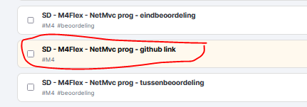

## ASP

- lees:
```

Web heeft vaak meerdere smaken, jullie kennen bijvoorbeeld al PHP.

een ander variant is ASP .net, die is van microsoft en is ook platform onafhankelijk
- waarom doen we dit?
    - verbreden is handig voor baankansen
```


## SDK installatie

> `sdk` staat voor `software developers kit`

Ga naar:
- https://dotnet.microsoft.com/en-us/download/dotnet/8.0

- installeer de SDK 8.0.x (hoogste) voor jouw systeem
    - voor windows zal dat de x64 versie zijn
- open je terminal/cmd
    - type dotnet
    - zie je dit?
        > 

## Check!

- check 
    - zag je wat er op het plaatje stond?
        - dan ben je klaar voor de start

## simulize
        
- lever je repository in in simulize
    > ZOEK M4Flex
    
    >
    