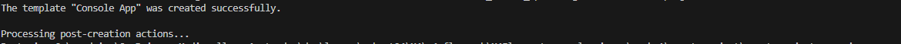
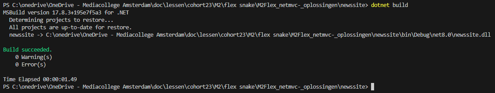
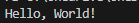
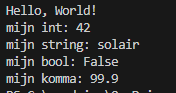

## startup

- maak een repository:
    - `M4FlexNetMVC`
- clone die naar je PC

- open je `M4FlexNetMVC` directory in visual studio code
    - maak een `.gitignore` file
        - zet daar het volgende in:
```
**bin
**obj
**.vs
**packages
**/csproj.user
```
> !!! Let op dat er geen spaties en tabs voor de ** staan

- maak in die `M4FlexNetMVC`  een nieuwe directory:
    - `eersteproject`

## eerste project

- lees:
```
.net heeft veel verschillende project types, laten we met de meest simpele beginnen:
- het console project
dit is om even de commandline te leren kennen

```

- open je terminal/cmd
    - ga naar je `eersteproject` directory
    - type `dotnet new console`
    > 


## draaien

- ga naar je `newssite` directory
- in je terminal type :
    - `dotnet build`
    > 
    - als er geen errors zijn:
        - type
            - `dotnet run`
            > 

## aanpassen & herhaling

- open Program.cs
    - maak 4 variabelen aan:
        - een int met een nummer
        - een string met een videogame character naam
        - een bool die op false staat
        - een float met een nummer (vergeet de f niet achter het nummer)
    - gebruik console writeline om:
        - de variabelen op het scherm te zetten

## build & run

- build je project
- run je project
- check!

    > 

#### WINDOWS

- heb je windows? dan mag je vanaf nu visual studio gebruiken:
> dat ontwikkeld sneller
[100_EXTRA_Windows.md](./100_EXTRA_Windows.md)

- de uitleg blijft in de console werken vanwege mac gebruikers. maar ik raad aan om visual studio te gebruiken!!

## Klaar?

- git add .
- git status
    - staan de `bin` en `obj` er tussen?
        - dan is je `.gitignore` niet goed
            - `fix` dat!
- commit naar je repo voor dit vak
