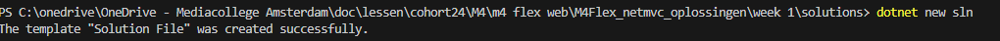
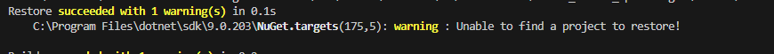
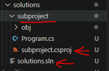
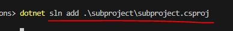

- maak in `M4FlexNetMVC` een nieuwe directory:
    - `solutions`
    
## project maken
- open je terminal/cmd
    - ga naar je `solutions` directory
    - type `dotnet new sln`

        > 

## build?

- probeer nu dotnet build
    > 
    
- lees:
    ```
    dat werkt niet? waarom?

    - omdat deze solution nog geen projecten heeft
    - die gaan we toevoegen
    ```

## project

- maak in `solutions` een nieuwe directory:
    - `subproject`
        - maak daar met dotnet new console een project aan
- controlleer of je dit hebt
    > 

## toevoegen

- voeg het project toe
    > 

- bouw nu met dotnet build

- run nu met het volgende commando:
    > 

## Klaar?


- commit & push naar je repo voor dit vak
