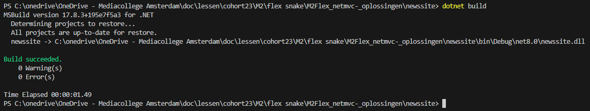

## startup

- open je `M4FlexNetMVC` directory in visual studio code
- maak in `M4FlexNetMVC` een nieuwe directory:
    - `newssite`

## project maken
- open je terminal/cmd
    - ga naar je `newssite` directory
    - type `dotnet new mvc`
        > 

## openen:

- controlleer of `newssite` in visual studio code er zo uitziet:
    > 

## draaien

- ga naar je `newssite` directory
- in je terminal type :
    - `dotnet build`
        > 
    - als er geen errors zijn:
        - type
            - `dotnet run`
            > 

- open je browser en ga naar het adres wat je in je terminal ziet
    > - bij mij is dat `http://localhost:5272/`
    > - Bij jou kan dat `ANDERS` zijn

- je krijg nu de site:
    > 

## Klaar?

- commit & push naar je repo voor dit vak

