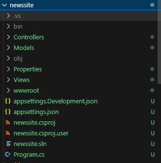
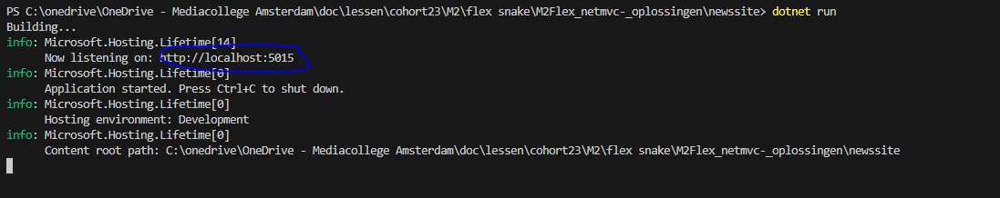
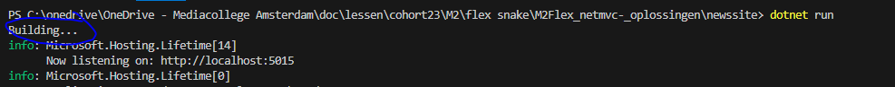
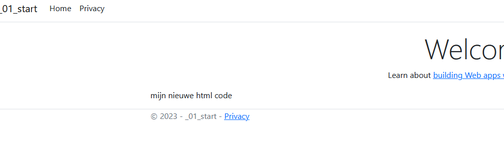

## Best veel files


> 

- lees:
    ```
    dat zijn een hoop files
    - `bin` en `obj`, worden door de compiler gemaakt, daar zitten we nu niet aan
    - `Controllers` is waar wij onze `logic` code stoppen
    - `Models` is waar wij code maken welke een `ding` modelleert
    - bijvoorbeeld: `persoon` , `auto`, `reis`
    - `Views` is waar onze `HTML` generatie code komt
    - `wwwroot` is waar *statische* `html`, `css` en `images` komen
    - `Program.cs` is het `startpunt` van onze code
    ```

## UITLEG Compilen
- lees:
    ``` 
    - Dit is `.net` niet javascript. 
        - Deze taal moet `gecompiled` worden
            - bij javascript gebeurt dat automatisch
    - Dit betekent als je iets veranderd aan je `.cs` code je:
        - opnieuw  `dotnet run` moet typen
            - deze `compiled automatisch` als er wat veranderd is
    ```
## proberen

- `dotnet run` je programma
     > 
- open de file:
    - `Views/Home/Index.cshtml`
    - zet daar `onderaan` het volgende in:
        ```HTML
        <section>mijn nieuwe html code</section>
        ``` 
    - open je website `ZONDER` te compilen
        > - je programma `runt` nog in de `terminal` 
        - is het veranderd?
    - stop je dotnet (`CTRL C`)
- `dotnet run` je programma nog een keer

     > 
     - zie je die `building...`?
     - open je site weer:
     > 

> Nu weten we hoe we de html aan kunnen passen
> maar nog niet wat we met de code kunnen


## Klaar?

- commit naar je repo voor dit vak