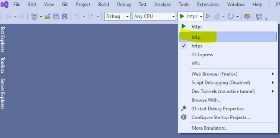

## install
- check:
    - heb je visual studio (niet code) geinstalleerd?
        - Nee?
            - Ga naar `## WINDOWS install`
        - Ja?
            -  Ga naar `## VISUAL STUDIO AANPASSEN`
 
## WINDOWS install 
### SLA DEZE STAP OVER ALS JE VISUAL STUDIO AL HEBT!
- download de community version
    - [visual studio](https://visualstudio.microsoft.com/thank-you-downloading-visual-studio/?sku=Community&channel=Release&version=VS2022&source=VSLandingPage&cid=2030&passive=false)

- start de installer en vink deze workload aan:
    > 
- open je terminal/cmd
    - type dotnet
    - zie je dit?
        > 

## VISUAL STUDIO AANPASSEN
### SLA DEZE STAP OVER ALS JE VISUAL STUDIO NET GEINSTALLEERD HEBT
- zoek naar de visual studio installer in je windows start menu
                >

- start de visual studio installer
    - click op modify
        >
    - check de volgende in ROOD omcirclde onderdelen aan
        >

## werkt het?

zag je wat er op het plaatje stond?
    - dan ben je klaar voor de start

    
## WINDOWS met visual studio:

#### project openen:
- dubbel click op het newssite.csproj
    - visual studio opent
        > 

#### draaien

- in visual studio zet je eerst de `https` naar `http`:
     > 
- druk dan op de `groene play` knop
     > 
