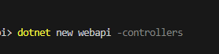
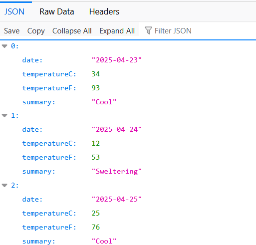

## Api

- open deze url in je browser:
    - https://pokeapi.co/api/v2/pokemon/kakuna
        - daar zien we json verschijnen uit de pokeapi.
            - dat kunnen wij met php ook, nu nog met dot net

- lees:
```
Het web hangt aan elkaar van api's 
bijvoorbeeld twitch heeft een hele api laag:
https://dev.twitch.tv/docs/api/

dus dit is iets wat wij als developer moeten begrijpen waar we ook werken
```


## Nieuw project en solution

- maak een nieuwe directory:
    - `week2api`
    - met daarin een nieuwe directory:
        - `weerapi`
- maak een nieuwe sln in week2api
- maak een nieuw project met:
    > 
- voeg het project toe aan de solution
    > 

## Git ignore

- lees:
    ```
    We moeten aanleren om altijd een .gitignore naast de solution file te zetten
    - dit is altijd stap 1!!
    ```
- zet een .gitignore file (MET JUISTE VULLING!) in de week2api directory

## controle

- controlleer of je dit nu hebt:
    > 

## run!

- run de solution (bouwt automatisch)
    > 
- open nu de site (kijk even GOED of je poort hetzelfde is)
    - http://localhost:5166/WeatherForecast

- nice nu hebben wij ook json:
    > 

## Klaar?


- commit & push naar je repo voor dit vak
