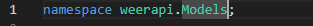
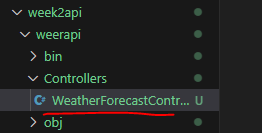
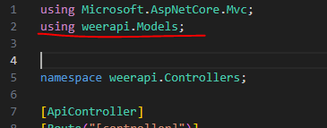
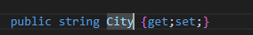
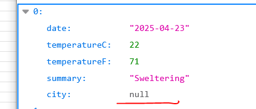
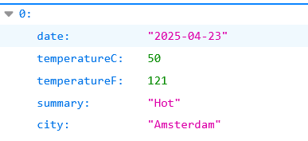

## Stad toevoegen

- lees:
```
- we gaan nu kijken of we de voorspelling met een stad kunnen uitbreiden\
- hiervoor moeten we het model aanpassen
```

## Model aanpassen:

- maak onder weerapi een nieuwe directory aan:
    - Models

- zoek `WeatherForecast.cs` en zet die in Models

- open nu `WeatherForecast.cs`
    - pas de namespace aan naar:
        > 

- run je solution
    - lees de fout!

- open `Controllers/WeatherForecastController.cs`
    > 
    - voeg daar een using aan toe:
        > 
    
- run!
    - nu doet die het wel

## stad toevoegen

- open nu `WeatherForecast.cs` weer
    - pas die aan voeg een string City toe:
        > 
- run en kijk hoe je json terugkomt
    > 

- zorg nu door `WeatherForecastController.cs` aan te passen dat overal amsterdam komt te staan
    > 


## Klaar?


- commit & push naar je repo voor dit vak
