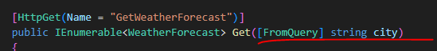
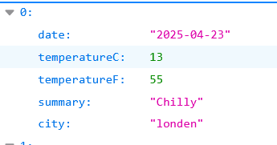
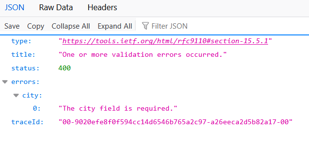
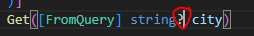

## zoeken

- lees:

    ```
    leuk zo'n weerbericht voor 1 stad...
    - laten we nu het aanpassen zodat we kunnen zoeken
    - daarvoor moeten we in de url de stad meegeven:
    http://localhost:5166/WeatherForecast?city=Amsterdam

    ```

## aanpassen

- open `WeatherForecastController.cs`
    - voeg deze code toe aan de Get:
        > 

- run!
    - open de url:
        - http://localhost:5166/WeatherForecast?city=London
        - je ziet nog steeds amsterdam
            - pas dat aan!
                > 

## zonder city?

- probeer even de url zonder city:
    - http://localhost:5166/WeatherForecast
        > 
    - dotnet controlleert of je alles wel goed meestuurt!

- oplossen
    - pas de code aan:
        > 
    - lees:
        ```
        met een ? geven we aan dat city ook null mag zijn
        ```
    - pas nu de code aan (gebruik een IF!) zodat we:
        - standaard amsterdam krijgen als city null is
        
## Klaar?


- commit & push naar je repo voor dit vak
