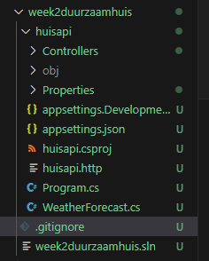
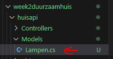
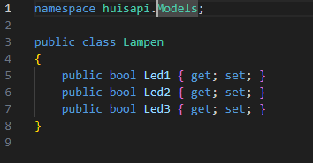
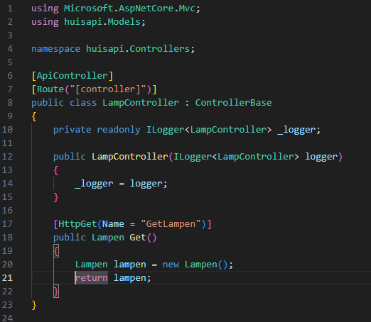
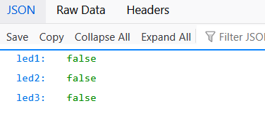
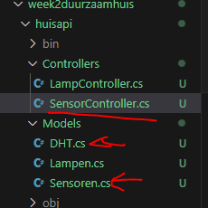
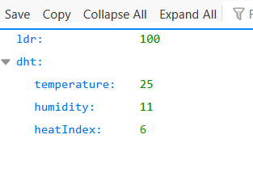

## Duurzaamhuis

- lees:
```
 we gaan nu een api maken voor duurzaamhuis, gewoon om het verschil een beetje te zien
```

- maak een nieuwe directory `week2duurzaamhuis`
    - maak een solution
    - maak in `week2duurzaamhuis` een directory `huisapi`

        - maak daar een webapi project met controllers aan (zie opgave 01 api)

## controle

- controlleer je project en solution:
    > 

## models

- we gaan nu de modellen maken, begin met de directory te maken:
    - Models
- daar maken we een nieuwe .cs file:
    > 
    
- open `Lampen.cs`
    - zet daar deze code in:
        > 
    
## Controller maken

- ga naar controllers
    - Hernoem WeatherForecastController.cs naar LampController.cs 
- gooi WeatherForecast.cs weg die hebben we niet meer nodig
- pas de code in LampController aan:
    > 


## run

- run en kijk of je bij de json kan komen:
    > 


## Sensoren

- maak de volgende files aan:
    > 

- maak dit na:
    >  

## Klaar?

- commit & push naar je repo voor dit vak
