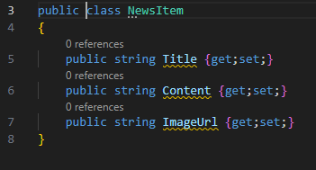
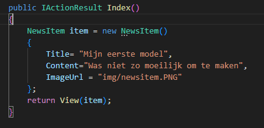
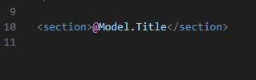
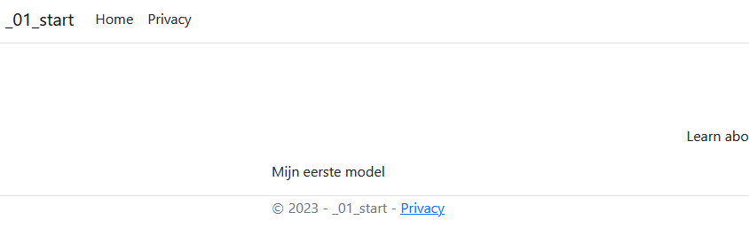
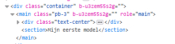
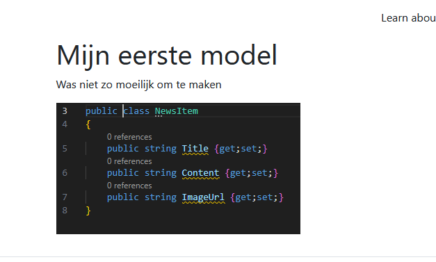
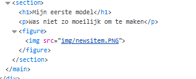

## newssite

- maak een nieuwe directory `week3razor`
    - maak kopieer je de directory `newssite` uit week1 naar deze map
        - maak een solution file
        - voeg het newssite project toe

- run en kijk of het werkt

## Laten we wat nieuws toevoegen

> we beginnen met het `model` van wat we gaan tonen:
> - nieuws heeft:
>     - een title
>     - een bericht
>     - een plaatje

## Model maken

- klap de `Models` directory open en maak een nieuwe file:
    - `NewsItem.cs`
        - zet het volgende daarin:
            > 

> #### UITLEG
> we maken een `class`, net als in `javascript` is dit:
> - een `doos` waar code die `bij elkaar` hoort in staat
> in ons geval zijn dat `eigenschappen` van een `nieuwsbericht`
> - `public` betekent dat we erbij mogen, voor modellen is dit gewoon
> - de `get;set;` betekent dat we de `string`:
>       - mogen opvragen
>       - een waarde mogen geven
> - `Title, Content en ImageUrl` zijn allemaal `class variablen`
>   - maar vanwege de `{get;set;}` noemen we ze `Properties`

## Controller aanpassen

- open `HomeController.cs` in `Controllers`
    - zoek de Index function
        - verander die zodat het er zo uitziet:
        > 
- open nu weer `Index.cshtml`
    > omdat we `View(item)` doen hebben we nu een `Model` in onze `html`
    - neem het volgende over:
    > 

- start je site opnieuw en kijk of je dit ziet:
    > 

> met de `@` springen we naar de `cs` code en printen we wat erachter staat naar de html
> 

## Volledig bericht

- download het plaatje
    - [./img/newsitem.PNG](./img/newsitem.PNG)
- ga naar `wwwroot`
    - maak een `img` directory
        - zet daar `newsitem.PNG` in
            > 

        
- maak het bericht nu af en zorg dat je dit krijgt:
    > 

## Html mooi maken voor later

- zorg dat je html er zo uit komt te zien:
    > 

- maak een `screenshot` van je site `mooiehtml.png`
    - zet die in je `screenshots` directory

## Klaar?

- commit naar je repo voor dit vak