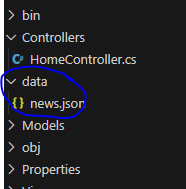
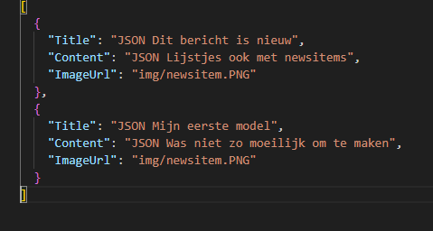
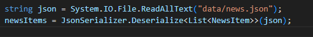
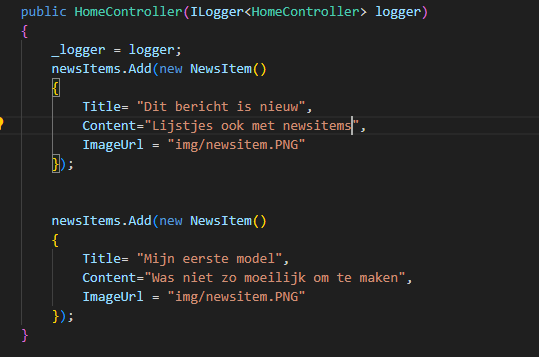
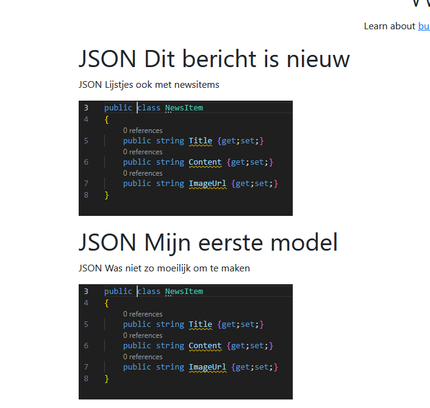

## Compilen...

> Nu moeten we elke keer compilen als we news willen toevoegen...
> dat is niet handig


## Json

We gaan voor nu even een `json` file maken als `data bron`

- maak een `data` directory naast je `Models` directory
    - maak daar een `news.json` file in aan
        > 
- zet daar het volgende in:
    > 

## berichten lezen

- open je `HomeController`
    - zet bovenaan deze code:
    ```Cs
    using System.Text.Json;
    ```
    - zet daar `onderaan` in de `constructor` :
        > 

- haal je `NewsItem`  maak en aan code weg
    - dus de `newsItems.add` die je in dit plaatje ziet:
        >
- test je site:
    >


## berichten toevoegen

- verzin zelf nog 2 berichten en voeg die toe met de json
    - gebruik andere plaatjes
- je hoeft je site niet te stoppen

## Klaar?

- commit naar je repo voor dit vak