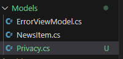

## HomeController

- kijk naar je project:
    > 
- lees:
```
- Zie je dat we 1 HomeController hebben?
- En dat we 2 cshtmls onder Home in Views hebben staan?

1 controller kan meerder views gebruiken
```

- Open je project, en run het.
    - ga naar privacy

## Breek de site

- lees & begrijp:
    
    > LET OP! Mijn poort is misschien anders dan die van jullie

- open de HomeController.cs
    - Zoek de privacy function
        - Pas de functie naam aan:       
            >    

            
- start je website
    - ga naar privacy:
        - http://localhost:5015/Home/Privacy
        > 
- lees:
    ```
    De function naam wordt de url
    dus de url moet nu:
    - Home/Privacy1
    zijn
    ```

## nieuwe url


- ga nu naar de nieuw url
    - http://localhost:5015/Home/Privacy1
        > 
- nog steeds kapot? lees:
    ```
    De  `return View();` regel zoekt de .cshtml file met DEZELFDE naam als de function.
    Dat wordt dus privacy1.cshtml

    die hebben we niet onder Views/Home
    ```

- verander de function naam weer terug naar Privacy

## Privacy Model

- maak een nieuw model Privacy.cs onder Models
    > 

- Geef het model 2 properties:
    > 

- Open HomeController.cs
    - ga naar de Privacy function
        - Geef het nieuwe model mee aan de View:
            > 

## Html weergave

- gebruik nu @Model in je Privacy.cshtml om het volgende voor elkaar te krijgen:
    > 


## Klaar?

- commit naar je repo voor dit vak