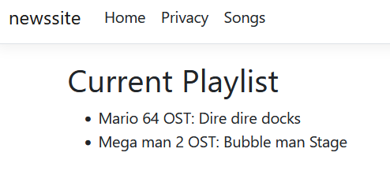

## Zelf doen ^^


- Lees de opdracht hieronder en maak die
```
 - Kies een nieuwe pagina:
       - reviews
       - films
       - liedjes
       - artiekelen
       - autos
       - games
       - of verzin zelf iets
 - maak nu een nieuwe Pagina voor jouw onderwerp
 - gebruik wat je geleerd hebt om daar vanuit een `data bron` meerdere van te tonen
      - Maak een nieuwe Controller, Model en View!!
```

## Voorbeeld
> 
## Klaar?

- commit naar je repo voor dit vak