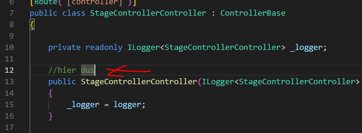
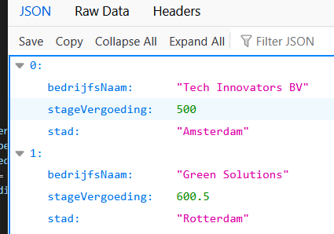

## starten


## Nieuw project en solution

- maak een nieuwe directory:
    - `week4staticfiles`
    - met daarin een nieuwe directory:
        - `stageapi`
- maak een nieuwe sln in week4staticfiles
- maak een nieuw webapi project 
- voeg het project toe aan de solution

## Stage controller

- maak een nieuwe controller:
    - StageController
- maak een nieuw Model in Models
    - Stage

- verwijder de WeatherForecast Controller & WeatherForecast Model
    > 

## Data

- open StageController 
    - zoek deze plek in de code:
    > 

- plak de code hieronder in de class boven de constructor op die plek
    ```csharp

            List<Stage> stages = new List<Stage>
        {
            new Stage { BedrijfsNaam = "Tech Innovators BV", StageVergoeding = 500.00, Stad = "Amsterdam" },
            new Stage { BedrijfsNaam = "Green Solutions", StageVergoeding = 600.50, Stad = "Rotterdam" },
            new Stage { BedrijfsNaam = "Future Designs", StageVergoeding = 450.75, Stad = "Utrecht" },
            new Stage { BedrijfsNaam = "EduWorld", StageVergoeding = 400.00, Stad = "Den Haag" },
            new Stage { BedrijfsNaam = "Code Creators", StageVergoeding = 550.00, Stad = "Eindhoven" }
        };
    ```

## Get

- zorg dat de get direct de stages terug geeft:

    > 
    
## Klaar?

- commit naar je repo voor dit vak