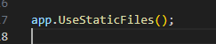
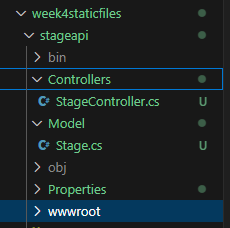
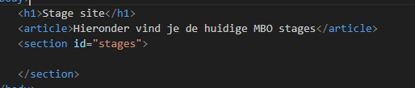
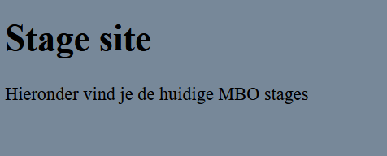
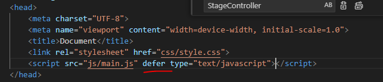
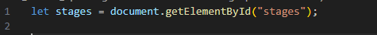
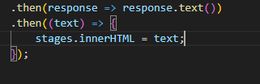
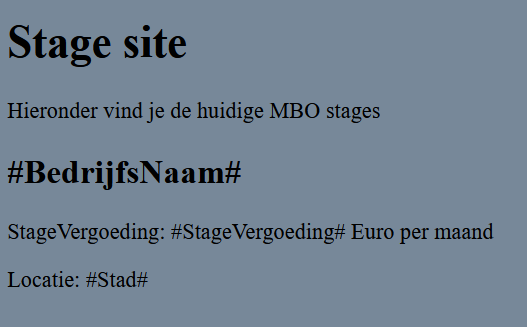

## static files


- open Program.cs
    - voeg het volgende toe:
        > 

- maak een nieuwe directory in stageapi:
    - wwwroot
- controlleer of je nu dit hebt:
    > 


## index.html

- maak in wwwroot een index.html

- zet daar standaard html vulling in (body etc met !)
- zet in de body de volgende html
    > 


## style

- maak een css directory in wwwroot
    - maak daar een style.css file aan
- koppel die aan je index.html
- geef de body wat styling en kijk of het werkt:
    > 


## javascript

- maak een js directory in wwwroot
    - maak daar een main.js file aan

- lees:
```
we hebben een api in c# gemaakt. Deze api heeft stage data.
Die gaan we laden met javascript. Daar gebruiken we fetch voor

We gaan OOK de stage html laden met javascript
```

- koppel de javascript aan je index.html
    - vergeet NIET om een defer attribuut in je script tag te zetten
    > 
- bedenk: wat doet die defer ook al weer?

## htmlview

- maak in wwwroot een nieuwe directory:
    - views
- maak in views een stageview.html
    - zet daar de volgende html in:
        ```HTML
            <section class="stage">
                <h2>#BedrijfsNaam#</h2>
                <p>StageVergoeding: #StageVergoeding# Euro per maand</p>
                <p>Locatie: #Stad#</p>
            </section>
        ```

## main.js

- we gaan nu aan de slag met de fetch api, gebruik de volgende url als je het niet meer weet:
    - https://developer.mozilla.org/en-US/docs/Web/API/Fetch_API/Using_Fetch


- eerst halen we even het element op wat we gaan vullen:
    > 

- maak nu een fetch naar views/stageview.html (gebruik geen await maar de then constructie!)
    - voor de then gebruik je de volgende code:
    > 

- controlleer of je nu dit hebt in je browser:
    > 

## Klaar?

- commit naar je repo voor dit vak