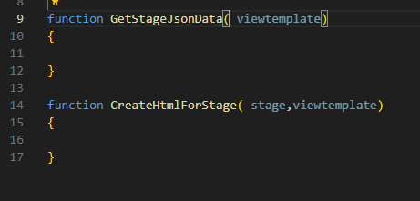
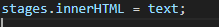
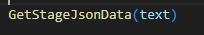
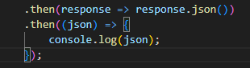
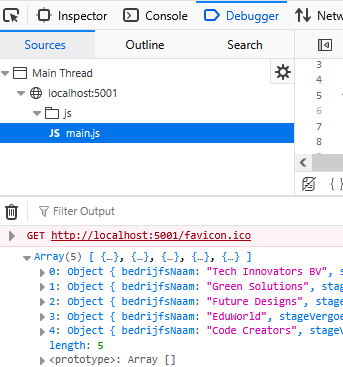
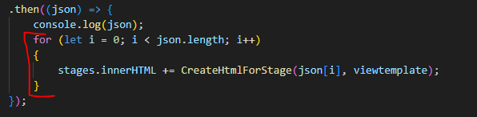
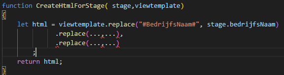
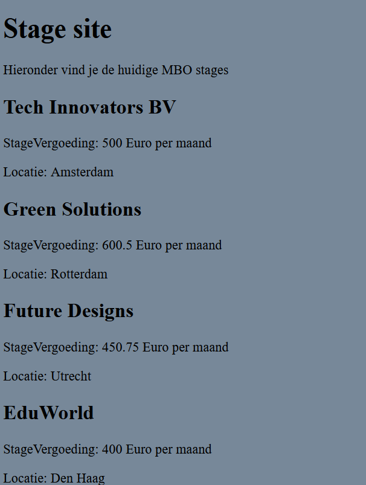
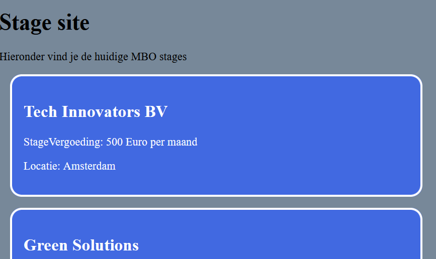

## fetch chaining

- lees:
    ```
    1) Eerst halen we de view 
    De view wordt een template. Deze string bewaren we en gebruiken we voor ELKE stage in de json

    2) Nadat we de view hebben opgehaald gaan we de json ophalen

    3) voor elke stage in de json gaan we de template gebruiken om een nieuw stuk html toe te voegen
    ```

- laten we even wat functions maken:
    > 

## GetStageJsonData aanroepen

- ga naar je fetch 
    - maak van :
        > 
    - het volgende:
        > 

## fetch json
- maak in de function GetStageJsonData een fetch naar Stage (de StageController)
    - gebruik niet .text() maar .json()
    - log de json response:
        > 

- test of je de json in je console ziet:
    > 

## json naar html

- ga naar GetStageJsonData
    - verander de code naar:
        > 

- bijna klaar, nu nog de html maken:
    > 
    - lees:
    ```
    Zie je die replace? dat we de zelf verzonnen tag #BedrijfsNaam# vervangen met de echte data?
    ```
    - maak het af en zet de StageVergoeding en Stad er ook bij

## test!

- test en controlleer:
    > 

## style

- style het geheel iets beter (eigen invulling):
    > 


## Klaar?

- commit naar je repo voor dit vak