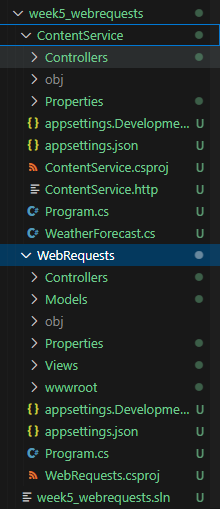
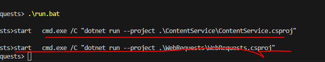

## WebRequests maken

- lees dit eerst:
```
We gaan nu in 1 solution 2 projecten maken:
- 1 die de website host
- 1 die een webservice host

de website zal bij de webservice data ophalen
> vaak zullen we een soortgelijke structuur hebben in web projecten


```

## Nieuw project en solution

- maak een nieuwe directory:
    - `week5_webrequests`
    - met daarin een nieuwe directory:
        - `WebRequests`
        - `ContentService`
- maak een nieuwe sln in week5_webrequests
- maak een nieuw webapi project  in ContentService
- maak een nieuw mvc project  in WebRequests
- voeg het project toe aan de solution

- controlleer je Solution:
    > 
    
## build

- build nu je solution met dotnet build

## Run?

- lees:
```

wij hebben 2 projecten die alletwee straks moeten draaien om een werkend geheel te krijgen

in visual studio kan je meerdere projecten tegelijk starten. (zie extra/01 multi start vs.md)
Dat werkt niet op de commandline er zijn 2 opties:
1) 2 terminals en beide gebruiken
2) een batch file gebruiken
```

- wij gebruiken even een batch file: run.bat
    - deze staat in deze git (week5_webrequests/run.bat)
    - kopieer deze file en zet die naast je solution file 

- run de batch file:
    > 
    - deze opent nu twee terminals met de applicaties erin
## Klaar?

- commit naar je repo voor dit vak