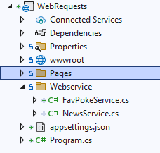

## News ophalen

    

### NewsController

- maak in het ContentService project een nieuwe Controller:
    - NewsController
        > 
    - pas de code aan zodat het dit wordt:
        > 
- ruim de weatherforecast files weer op

### TEST!

- start de projecten
    - ga naar:
        - http://localhost:5193/News
        - krijg je je news als json te zien?


### Haal het News op

- ga nu naar het Webservice project
    - maak daar een mapje aan:
        - Webservice
    - en maak in die map Webservice 2 nieuwe classes:
        - FavPokeService
        - NewsService
            > 


### Code

- open nu NewsService
- maak in de NewsService class een nieuwe function:
    - public
    - string[]
    - GetNewsHeaders
- zet daar de volgende code in:
        > 
    - de poort 5193 moet je even aanpassen naar jouw contentservice poort!
        > 

- lees deze uitleg:
```
HttpClient is een class waarmee wij heel makkelijk iets van een server kunnen halen
> HttpClient is een IDisposable class, dus moet er een using omheen
> dit is om later de resources die HttpClient gebruikt weer netjes vrij te geven

De code GetFromJsonAsync is wat lastiger
We moeten tussen de <> aangeven wat voor ding de json moet worden

daarna omdat de functie ASYNC is moeten we even .Result doen. Anders krijgen we niets terug
> ASYNC is interessant, kijk daar zelf even naar 
```


### NewsService gebruiken

- ga nu naar de Index.cshtml van het Webservice project
- boven in de file zetten we:
    > 
- zet daar de volgende code in:
    > 
- maak nu de for loop zoals in het commentaar staat zodat je dit krijgt:
    > 


## klaar

- commit & push naar je github       