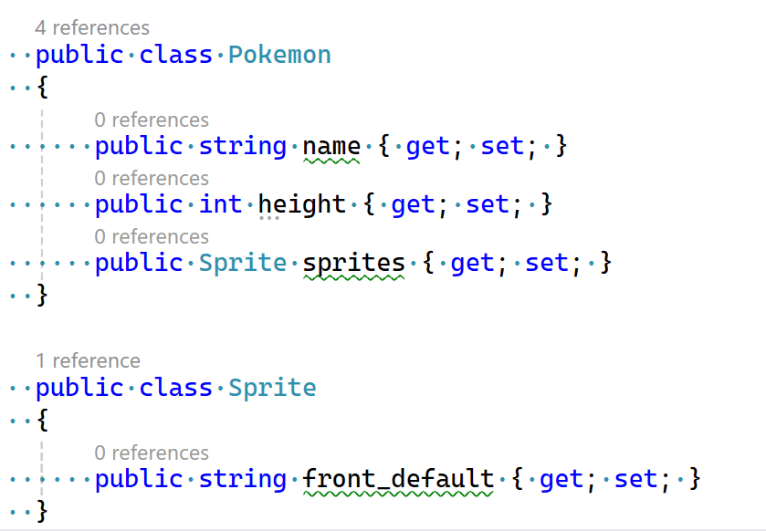

## News ophalen

    


### Haal Json uit een externe API

- ga nu naar het Webservice project
- open nu FavPokeService in het Webservice mapje
    > 
    

- maak daar een nieuwe function
    - GetFavPokemonJson
    - deze heeft een string als return
        > HINT: lijkt op GetNewsHeaders uit NewsService
    - wat anders is:
        - je gebruikt deze url https://pokeapi.co/api/v2/pokemon/ditto
        - en je gebruikt een andere functie van httpClient:
            > 


### json laten zien

- voeg nu code toe aan Index.cshtml
    - haal de string op met de GetFavPokemonJson
        > hint kijk ook naar hoe je het met GetNewsHeaders moest doen

- dan krijg je zoiets op het beeld:
    > 


### data classes

- lees deze uitleg:
```
om de data in json te gebruiken willen we vaak die data naar classes omzetten
dat doen we met een serializer, dat komt straks

En we hebben dan ook classes nodig om de data in te zetten, die gaan we nu maken

```

- open FavPokeService.cs
    - maak de code hieronder na:
        - zet dit onder je FavPokeService class
        > 

### json gebruiken


- om data uit de json te halen gaan we een nieuwe function maken in FavPokeService

- open FavPokeService.cs
    - maak een nieuwe function:
        - public
        - PokeMon als return type
        - GetFavoritePokemon als naam
        - zet deze code in de function:
            > 


### index aanpassen


- voeg code toe om FavPokeService te maken
    > hint: kijk naar hoe we dat deden met NewsService
- maak een nieuwe variable:
    - PokeMon als type
    - pokemon als naam
- gebruik nu GetFavoritePokemon om de pokemon op te halen EN in die variable te stoppen


- zet nu deze code in je index.cshtml:
    > 

- test!
    - nu krijg je de pokemon ditto te zien
    > 

## klaar

- commit & push naar je github       