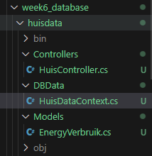
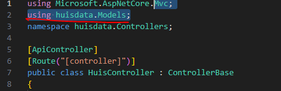
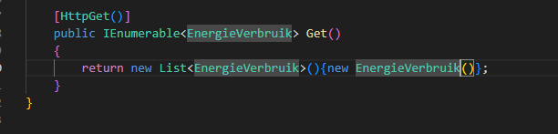

## Data

- lees dit eerst:
```
Tot nu toe hebben we data in json of direct in de applicatie gezet
dat is niet handig.

We gaan nu een lokale database gebruiken

```

## Nieuw project en solution

- maak een nieuwe directory:
    - `week6_database`
    - met daarin een nieuwe directory:
        - `huisdata`
- maak een nieuwe sln in week6_database
- maak een nieuw webapi project
- voeg het project toe aan de solution

## database libraries

- open een terminal in je `huisdata`
    - type `dotnet add package Microsoft.Data.Sqlite`
    > hier halen we een code library van het internet en koppelen we die aan ons project

## Huis Controller

- maak een HuisController en een EnergyVerbruik Model
- maak ook een DbData directory aan
- maak daar een nieuwe file:
    - `HuisDataContext.cs`
     > 


## stub data

- open HuisController
    - zorg dat je de models importeert:
        > 
    - maak of verander de get in:
        > 
    
## Klaar?

- commit naar je repo voor dit vak