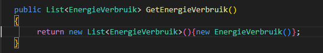

## HuisDataContext

- open HuisDataContext.cs

- we maken een nieuwe `constructor` aan
    > deze speciale function gaat af na de `new` van HuisDataContext
    - neem het volgende over:
        > 

- lees:
```
we gebruiken een `truukje` om de database (*newssite.db*) naast onze `.exe` te zetten
zodat die niet per ongeluk ergens anders komt te staan en we altijd weten waar die is
```

## Data ophalen

- we gaan verder in HuisDataContext.cs en maken deze function
    > 

- lees:
```
    - deze gaan we straks gebruiken in HomeController. waar nu dezelfde code staat
```

## Injection
- open nu Program.cs
    - voeg daar het volgende aan toe:
        > 

- lees:
```
- we vertellen de Dependancy Injection engine nu dat we ook een HuisDataContext hebben
- en dat we er altijd maar 1 van willen hebben (Singleton pattern)

- nu kunnen we in de constructors van onze controllers gewoon HuisDataContext zetten en die wordt automatisch gevuld
``` 

## Constructor

- open HuisController.cs
    - voeg de regels code toe:
        > 

- verander nu de Get function naar:
    > 

## Model

- ons model is nog leeg, pas dat aan:
    > 
- in HuisDataContext vul de data met 2 EnergyVerbruik en test:
    > 

## Klaar?

- commit naar je repo voor dit vak