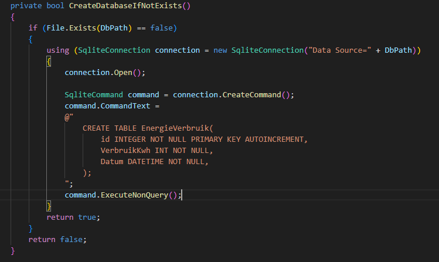
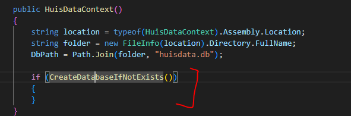
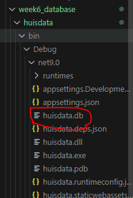
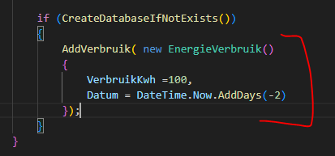
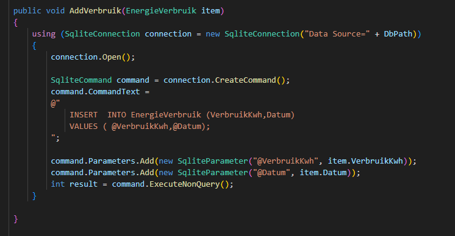
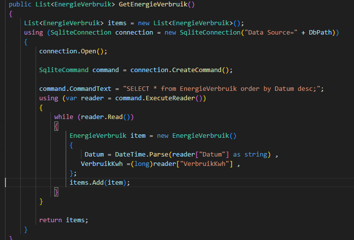
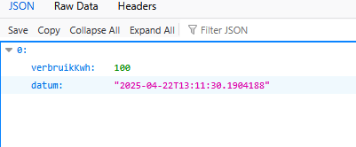

## Database & Tabel

- open HuisDataContext.cs

    - voeg deze function toe:
        > 

- lees:
    ```
    - we testen eerst of de database al bestaat.
    - zo niet maken we een connectie met de database (in dit geval een file)
        - als die file niet bestaat wordt die gemaakt
    - dan gebruiken we SQL om een tabel te maken
    ```

## aanroepen

- we roepen nu de function aan in de constructor:
    > 

## Test

- run je applicatie
    - roep de huis controller aan met de url in je browser
        - check je files:
            > 
        

## Leeg

- verwijder nu deze file, want die heeft nog de lege tabel
    > 

- lees:
    ```
    Als we de database wijzigen moeten we in ons geval de database weggooien.
    - LET OP! dit is alleen hier op school, in het echte werkveld doen we dat niet zomaar
    - er zijn allerlij manieren om een database aan te passen ZONDER te deleten 
    ```

## Vullen
- de tabel is nu leeg, we zetten er wat initeele vulling in:
    > 


- AddVerbruik hebben we nog niet die maken we:
    > 

- lees:
    ```
    - het is niet super netjes om elke keer een verbinding te maken, maar voor deze opdracht is het ok
    - je ziet dat we steeds SQL gebruiken om met de database te werken. Dit leer je ook in M4Prog SQL
    ```


## SELECT!

- verander GetEnergieVerbruik in:
    > 

## Test

- test of je de data krijgt te zien:
    > 

    
## Klaar?

- commit naar je repo voor dit vak