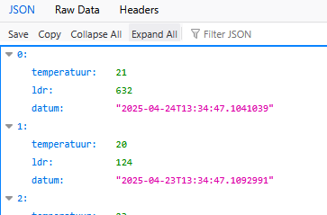

## Meer data

- Maak nu 10 EnergyVerbruik items, gebruik een for en Random:
    ```csharp
    Random.Shared.Next(0,25);//voorbeeld 0 tot 25
    ```

- maak nu nog een de volgende dingen erbij:
    - een SensorController
    - een SensorModel
        - LDR
        - Temperatuur
        - Datum
    - een SensorTabel waar het SensorModel in kan worden opgeslagen
    - zorg voor data, ook weer 10 met random
        > 

    
## Klaar?

- commit naar je repo voor dit vak