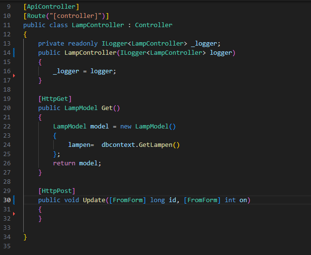
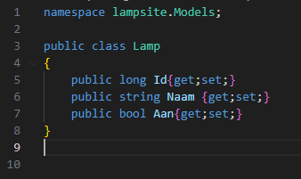
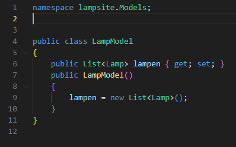
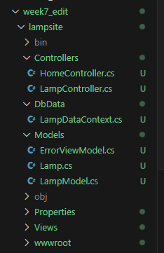
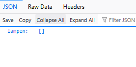

## Nieuw project en solution

- maak een nieuwe directory:
    - `week7_edit`
    - met daarin een nieuwe directory:
        - `lampsite`
- maak een nieuwe sln in week7_edit
- maak een nieuw mvc project
- voeg het project toe aan de solution

## database libraries

- open een terminal in je `lampsite`
    - type `dotnet add package Microsoft.Data.Sqlite`
    > hier halen we een code library van het internet en koppelen we die aan ons project

## LampController

- maak een LampController.cs onder Controllers
    - zet daar de volgende code in:
    > 
    
- maak een Lamp in Models
    > 
- maak een LampModel
    > 
    
- maak een directory DbData en zet daar de LampDataContext.cs in 
    > (staat in de git naast deze file)

- controlleer of je project er zo uit ziet 
    > 

## Build en test

- dotnet run
    - check je browser (let op je poort):
        - http://localhost:5268/Lamp
            > 

## Klaar?

- commit naar je repo voor dit vak