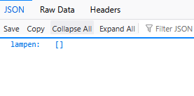
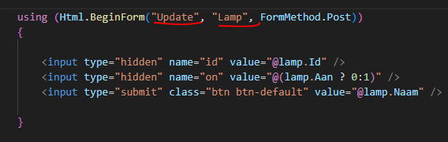

## Lege lamp:

- we hebben nu:
 > 


## singleton

- we zorgen eerst dat de LampDataContext beschikbaar is:
    - open Program.cs
        > 
    
- ga naar de LampController en zorg dat je Lampen vult met de LampDataContext
    > kijk ook in week 6!!

- test!
    > 

## knoppen

- lees:
    ```
    - we gaat nu per lamp een knop maken
    - dat doen we voor nu even in de Index.cshtml van Home
    - we moeten daar een form voor gebruiken, maar deze maken we via c#
    ```

- open de HomeController
 - pas de code aan zodat HomeController ook een LampController krijgt:
    > 

- lees:
    ```
        dit is even een verkorte manier van doen, en niet super netjes. 
        In het echt zou je minimaal 2 projecten hebben (de api en de website)
        Want je zou waarschijnlijk met javascript willen posten ipv direct, dat is sneller en moderner
        alleen dat kost meer tijd dan we hebben in de les
    ```
- pas de Index function aan zodat die het LampModel ophaalt en doorgeeft aan de view:
    > 

## Dependencies

- lees:
    ```
    Nu is HomeController afhankelijk van LampController, dat is een dependency zoals we dat noemen
    - in program.cs regelen we de dependencies via dependancy injection
    LampController is weer afhankelijk van LampDataContext. het wordt een beetje een keten
    ```

- open Program.cs, voeg nu ook de LampController toe aan de services:
    > 

## Form
- open de Index.cshtml van Home
    - nu hebben we het LampModel beschikbaar als Model, voeg een for loop toe:
        > 
- maak in de form dit na:
    > 

- lees:
    ```
    zie je die Html.BeginForm? Daarmee zeggen we maak een html formulier
    die update en lamp strings worden de url:
    - http://localhost:5268/Lamp/Update
    kijk in LampController naar de function Update, zie je dat de update naam dan in de url zit?
    ```

## lampje aan of uit?

- gebruik in Index.cshtml een if om te laten zien of de lamp aan of uit is
    > 


## Klaar?

- commit naar je repo voor dit vak