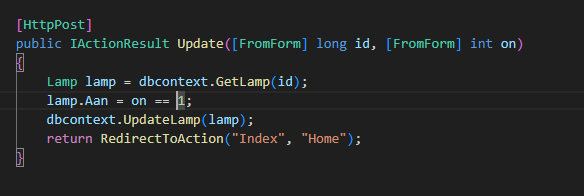
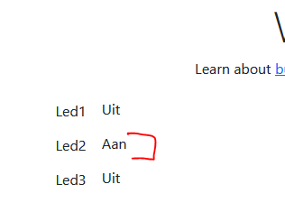
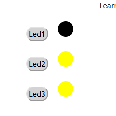

## Update aanpassen
- open LampController

- we passen update nog even aan:
    > 

- lees:
    ```
    we hebben nu meer functions op de dbContext gemaakt, deze zijn er nog niet!
    Als alles gelukt is gaan we terug naar de Index van Home
    ```

## Get Lamp?

- maak zelf de GetLamp function in LampDataContext. 
    - lees de tips:
        > - Gebruik GetLampen als voorbeeld
        > - je hebt maar 1 lamp nodig, gebruik een where in je select en gebruik de id!

## UpdateLamp

- maak alvast de UpdateLamp function zonder vulling
    - we kunnen bijna hetzelfde doen als bij de insert, alleen gebruiken we nu een update SQL statement:
        > 

## Aan en uit

- test je site
    - kan je nu de lampen aan en uit zetten?
        > 

## css

- gebruik css om het wat op te leuken:
    > 

## Klaar?

- commit naar je repo voor dit vak

https://learn.microsoft.com/en-us/dotnet/core/tools/dotnet-reference-add

https://learn.microsoft.com/en-us/dotnet/core/tutorials/library-with-visual-studio-code